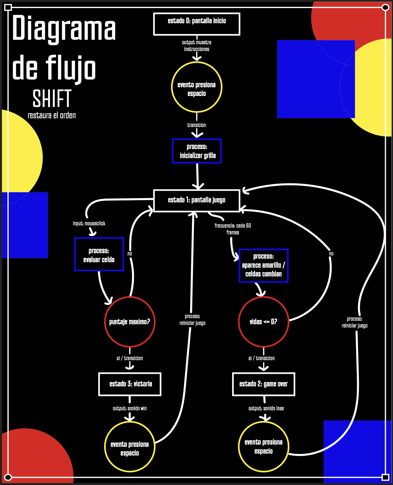

# pensamiento_computacional_Examen
proceso de mi examen de pensamiento computacional 
# SHIFT - Restaura el Orden (Inspirado en la Bauhaus)
El proyecto es un juego interactivo programado en p5.js que se basa en las logicas geometricas y de color de la escuela de diseño Bauhaus.

## Enlaces del Proyecto
* [Link para Jugar en Vivo](https://editor.p5js.org/claudia.castro3/full/1u2OK23SA)
* [Link para Revisar el Código en p5.js](https://editor.p5js.org/claudia.castro3/sketches/1u2OK23SA)

---

## Descripción

### Descripción Objetiva
SHIFT es un juego visual e interactivo de reaccion rapida. En la pantalla se muestra una grilla de 8x8 casillas sobre un fondo negro. Al principio del juego todas las casillas son circulos blancos pero al avanzar el tiempo las celdas se empiezan a poner de color amarillo de forma aleatoria. El usuario tiene que hacer click rapido sobre los circulos amarillos antes de que se acabe el tiempo de la celda y cambie a color rojo. Si se clickea bien el circulo se transforma en un cuadrado azul y da puntaje. Si el jugador se equivoca o la celda se vuelve roja se pierde una vida. El juego termina cuando completas toda la grilla con cuadrados azules (Victoria) o si te quedas sin vidas (Game Over). 

### Descripción Conceptual
El proyecto se expande a partir de la solemne II y se inspira directamente en la **Bauhaus**. Mas que copiar la estetica a la fuerza busque traducir su logica de diseño a un sistema computacional. Use la triada de colores primarios que planteaba Kandinsky y la asociacion de forma-color: el circulo amarillo (que representa tension y dinamismo dinamico), el cuadrado azul (que representa estabilidad y orden) y el circulo rojo como una alerta de error o peligro. El juego conceptualmente se trata de pasar del caos y la alerta (amarillo/rojo) a restaurar el orden estructural del espacio (el cuadrado azul) por eso al ganar el juego dice !RESTAURASTE EL ORDEN¡ que seria la mision principal del juego.

---

##Sistema Computacional

Aca explico como funciona la estructura interna del codigo y como se procesa todo el sistema:

* **Inputs:** El sistema recibe clics del mouse (`mouseX` y `mouseY` en la funcion `mousePressed`) para interactuar con las celdas y la barra espaciadora (`key == " "`) para controlar las pantallas.
* **Procesos:** * Se calcula la distancia con `dist()` para saber exactamente en que casilla se hizo click.
  * El sistema corre un contador de frames para activar celdas amarillas al azar usando `random()`.
  * Hay una funcion que actualiza el tiempo interno de cada celda individual (`tiempoCelda[][]`) para manejar las alertas.
  * Se usa la funcion `map()` para transformar de manera proporcional el puntaje actual del jugador en el ancho de la barra de progreso que se dibuja abajo.
* **Estados:** El programa se divide en 4 estados bien claros que cambian la logica:
  * **Estado 0:** Pantalla de inicio (Muestra instrucciones y una grilla decorativa de fondo).
  * **Estado 1:** Pantalla de juego (Activa los temporizadores, el puntaje, las vidas y la interaccion).
  * **Estado 2:** Game Over (Detiene el juego y congela la pantalla al perder las 3 vidas).
  * **Estado 3:** Victoria (Pantalla final al llenar la grilla con cuadrados azules).
* **Eventos:** * Presionar la barra espaciadora cambia del Estado 0 al 1, o reinicia el juego desde el Estado 2 y 3.
  * Que el temporizador de una celda amarilla llegue a 60 frames activa el cambio a rojo y la resta de vidas.
  * Alcanzar el puntaje maximo (`filas * columnas`) gatilla el estado de victoria.
* **Outputs:** Un sistema visual dinamico en p5.js que redibuja las formas en tiempo real y outputs sonoros que se activan con los eventos del juego (sonidos de error, victoria y derrota).

---

## Recursos Multimedia Utilizados

Para cumplir con el requerimiento use archivos de audio integrados directamente en la mecanica del juego (no son solo musica de fondo para decorar):
* **error.mp3:** Suena inmediatamente cuando una celda se quema y se pone roja, o cuando clickeas mal. Te avisa que perdiste una vida.
* **win.mp3:** Se reproduce al ganar el juego en el Estado 3.
* **lose.mp3:** Se activa justo cuando las vidas llegan a 0 para dar la sensacion de fracaso en el Game Over.
use sonidos que fueran de juegos de arcade, creo que la vibra retro quedaba bien con mi proyecto por eso me fui por esos sonidos.
---

## Diagrama de Flujo

Este es el mapa de como funciona la logica completa del sistema interactivo, recicle parte de mi diagrama de flujo pasado, mas o menos la estetica que esta inspirada en la estetica del juego:

---

##Proceso

La verdad no siento que tenga un proceso tan extenso porque la estetica inicial la tome toda de mi solemne dos solo que lo traduje al sistema del juego y elimine la caracteristicas Opart que tenia mi solemne 2 porque no queria copiarla totalmente, sino que use lo que yo creia que me iba a funcionar para el juego:

### Idea
como ya dije use mi solemne 2 para traducirla al sistema de juego cambiando algunas cosas, me mantuve en los colores y formas pero elimine la caracteristica Opart que era el cambio progresivo de colores y de tamaños en las formas
adjunto mi solemne 2 para que se entienda:

[solemne 2](https://editor.p5js.org/claudia.castro3/full/VhYAXNIZ7)

### Iteraciones del Desarrollo
No saque fotos del proceso pero al principio los colores del fondo iban invertidos pero no me gusto que los circulos tuvieran un contorno negro y siento que se ve mejor con el contraste del fondo negro y los colores de las formas. otra cosa que cambie o mejore en el transcurso fue el temaño de las formas, al principio tenia los circulos de la grilla muy pequeños y aunque le agregaba dificultad preferi cambiar la velocidad para hacerlo mas dificil y agrandar los circulos porque se veian mejor asi, y al final me di cuenta que me faltaba la parte map() de la rubrica y la solucion que encontre fue agregar la barra de progreso al final 

### dificultades
En el proceso tuve muchas dificultades porque me a costado bastante entender la clase, algunas de las cosas que me pasaban era que el codigo no funcionaba o olvidaba muy seguido como tenia que hacer las cosas, me apoye de los tutoriales de p5.js pero tambien use la inteligencia artificial para que me explique, algunas de las cosas que se pueden hacer es pedirle que explique algo especifico como funciona, o lo otro era usar slides de las clases y pedirle que las explicara de forma mas extensa, de esa forma logre entender un poco mas como hacerlo pero en muchos momentos tuve que copiar parte del codigo en la ia para que me dijera donde estaba el problema porque yo no lograba entender el problema, en esa parte fue de mucha ayuda para lograr llegar a tiempo porque al no entender donde tenia los errores no lograba avanzar y perdia mucho tiempo 

---

## Reflexión Final

Las principales decisiones del proyecto pasaron por simplificar la interfaz para mantener el minimalismo aleman pero sin que se volviera fome. Al principio costo caleta hacer que cada celda de la matriz tuviera su propio reloj independiente sin que se me bugeara todo el juego, ahi me di cuenta que la clave era armar un array paralelo (`tiempoCelda`) exclusivo para los frames de cada casilla. El mayor aprendizaje que me llevo es a estructurar bien el codigo usando funciones propias bien compartimentadas, porque al final si dejas todo tirado en el `draw` se te arma un espagueti insufrible y despues no encuentras ningun error.
